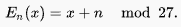
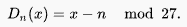
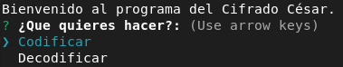
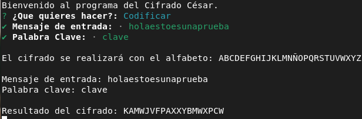
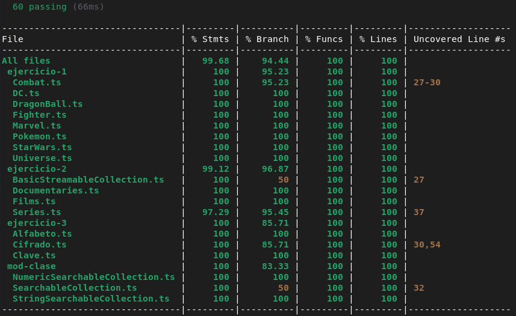
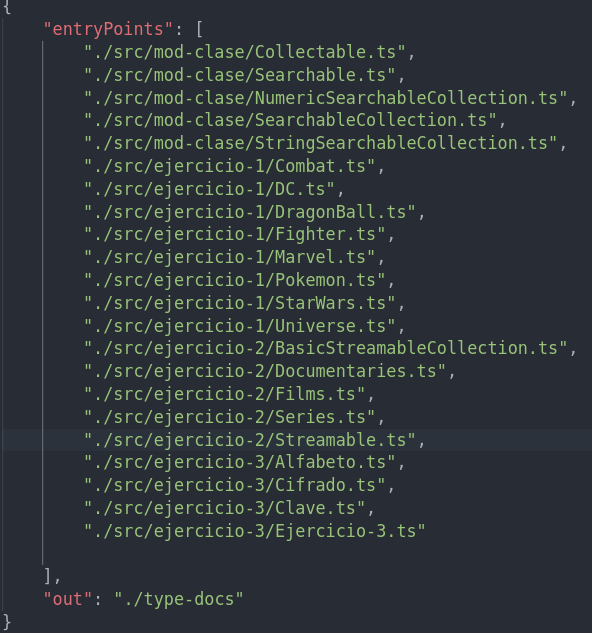
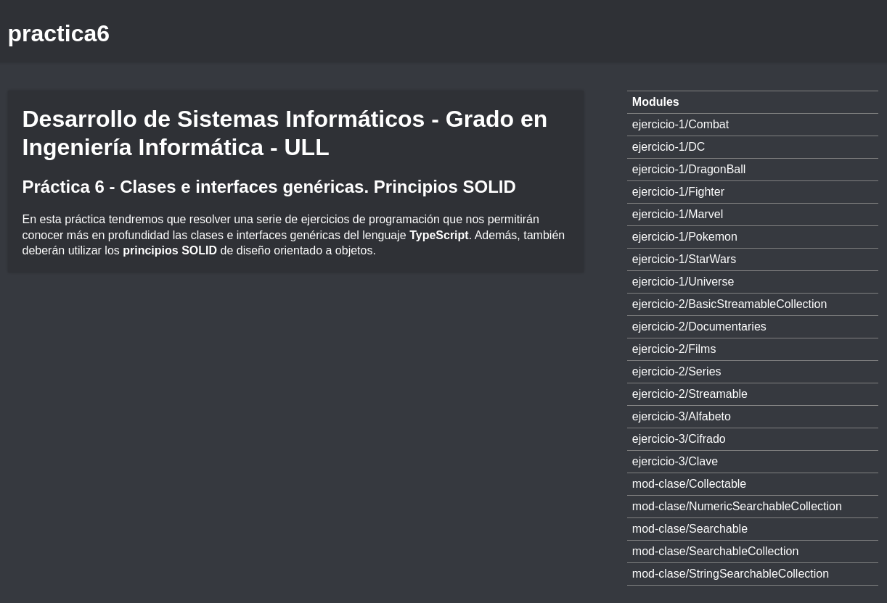

# Informe Práctica 6.
## Clases e interfaces genéricas. Principios SOLID

## 1. Introducción
---
En esta práctica tendremos que realizar tres ejercicios de programación en **TypeScript** utilizando clases, interfaces genéricas y siguiendo los principios *SOLID*. Los principios *SOLID* son un conjunto de principios de diseño orientado a objetos resumidos y difundidos por Robert C. Martin y M. Feathers. *SOLID* proviene de las iniciales de los cinco principios a los que se refiere:

1. Single responsibility principle
2. Open-closed principle
3. Liskov substitution principle
4. Interface segregation principle
5. Dependency inversion principle

## 2. Objetivos
---
Tendremos que alcanzar los siguientes objetivos:
- Mejorar el cubrimiento de código mediante **Coveralls** e **Instambul**.
- Profundizar en cuanto a las pruebas unitarias con **Mocha** y **Chai**.
- Aprender a utilizar adecuadamente las clases y las interfaces.

## 3. Ejercicios.
---
A estas alturas ya hay que tener la plantilla de la [estructura básica del proyecto](https://ull-esit-inf-dsi-2122.github.io/typescript-theory/typescript-project-setup.html) y además tener la configuración realizada de [TypeDoc](https://drive.google.com/file/d/19LLLCuWg7u0TjjKz9q8ZhOXgbrKtPUme/view), [Mocha y Chai](https://drive.google.com/file/d/1-z1oNOZP70WBDyhaaUijjHvFtqd6eAmJ/view) y [Coveralls - Instambul](https://drive.google.com/file/d/1xLDc4CpoYpsAlCFO_4DMwu7MKCtcZDnh/view) correctamente.

Los ejercicios se han realizado utilizando la metodología **TDD** para comprobar el correcto funcionamiento del código mediante pruebas unitarias.

También se ha incluido **Coveralls** para ver el índice de cubrimiento de las pruebas en nuestro código.

## 3.1. Ejercicio 1 - El combate definitivo
---
Partiendo del desarrollo realizado para el Ejercicio 1 de la [Práctica 5](https://ull-esit-inf-dsi-2122.github.io/prct05-objects-classes-interfaces/), supongamos que ahora queremos incluir distintos tipos de contendientes a la pelea. Por ejemplo, podríamos incluir personajes del universo Marvel, DC Comics, Star Wars o Dragon Ball entre otros. Puede incluir otros universos y/o personajes que desee. Para **extender** el desarrollo anterior se pide:

- Desarrolle una clase abstracta llamada `Fighter` que permita hacer que un contendiente pueda luchar. Esta clase se considerará la superclase del resto de clases a implementar. Para cada universo, desarrolle la clase que lo represente (Pokemon, Marvel, DC, Star Wars, Dragon Ball, etc).
- Cada contendiente debe ser descendiente de su clase universo. Además, para cada contendiente se debe poder acceder a la información requerida para la clase **Pokemon** de la práctica anterior (nombre, altura, peso, etc). Puede incluir información extra que considere oportuna según el universo.
- La clase `Combat` ahora permitirá que los combates se disputen entre contendientes de distintos universos. Todas las combinaciones deben ser posibles, incluso contendientes del mismo universo. Asimismo, la simulación de los combates debe ser similar a la realizada en la práctica anterior. Sin embargo, ahora con cada ataque los contendientes deberán mostrar alguna catching phrase representativa de su personaje.
- Actualice los valores de efectividad de los movimientos de los nuevos contendientes de la forma que considere oportuna. Contendientes de un universo son más fuertes que los de otro, personajes concretos son más fuertes que otros sin importar el universo o una mezcla de ambas. Puede basarse en un criterio similar al empleado en las prácticas anteriores sobre los tipos de Pokemon.
- La clase `Pokedex` deberá actualizarse para incluir también el resto de contendientes. Esto es, deberá ser capaz de almacenar personajes de todos los universos considerados dentro de una misma estructura de datos. Además, deberá ofrecer todas las funcionalidades previamente requeridas para los nuevos contendientes.
- Por último, desarrolle este ejercicio empleando los principios SOLID Single Responsability y Open-Closed.

**Ejercicio resuelto:**

**Clase Fighter:**

```ts
/**
 * Clase abstracta Fighter.
 */
export abstract class Fighter {
    /**
     * Constructor de la clase abstracta Fighter.
     * @param name Nombre del luchador.
     * @param weight Peso del luchador.
     * @param height Altura del luchador.
     * @param attack Poder de ataque del luchador.
     * @param defense Poder de defensa del luchador.
     * @param speed Velocidad del luchador.
     * @param health Salud (vida) del luchador.
     */
    constructor(
        protected name: string,
        protected weight: number,
        protected height: number,
        protected attack: number,
        protected defense: number,
        protected speed: number,
        protected health: number){}

    /**
     * Función getter para obtener el nombre del pokemon.
     * @returns Devuelve el nombre del pokemon que invoca la función.
     */
     public getName(): string {return this.name;}
     /**
      * Función getter para obtener la altura del pokemon.
      * @returns Devuelve la altura del pokemon que invoca la función.
      */
     public getHeight(): number {return this.height;}
     /**
      * Función getter para obtener el peso del pokemon.
      * @returns Devuelve el peso del pokemon que invoca la función.
      */
     public getWeight(): number {return this.weight;}
         /**
      * Función getter para obtener el poder de ataque del pokemon.
      * @returns Devuelve el poder de ataque del pokemon que invoca la función.
      */
     public getAttack(): number {return this.attack;}
     /**
      * Función getter para obtener el poder de defensa del pokemon.
      * @returns Devuelve el poder de defensa del pokemon que invoca la función.
      */
     public getDefense(): number {return this.defense;}
     /**
      * Función getter para obtener la velocidad del pokemon.
      * @returns Devuelve la velocidad del pokemon que invoca la función.
      */
     public getSpeed(): number {return this.speed;}
     /**
      * Función getter para obtener la salud del pokemon.
      * @returns Devuelve la salud del pokemon que invoca la función.
      */
     public getHealth(): number {return this.health;}
}
```

**Explicación de clase Fighter:**

Esta clase es una clase abstracta que tiene los métodos y los atributos que serán comunes para todos los luchadores del *Universo*. También cada subclase posteriormente tendrán sus propios métodos que no forman parte de los métodos comunes.

Los atributos de esta clase están comentados en el propio código donde se indica la tarea de cada uno de ellos. Estos atributos son **protected** para que puedan ser usados solo por la propia clase y por sus clases hijas.

Para ello disponemos de **getters** y **setters** donde podemos obtener y modificar los atributos **protected**.

**Clase Universe:**

```ts
import {Fighter} from "./Fighter";
/**
 * Clase Universe, contiene la colección de los luchadores de diferentes tipos. 
 */
export class Universe {
    /**
     * Constructor 
     * @param characters Array de luchadores de todos tipos.
     */
    constructor(private characters: Fighter[]) {}
    /**
     * Método getter que devuelve el array de luchadores.
     * @returns Devuelve el array de luchadores.
     */
    getCharacters(): Fighter[] {return this.characters;}
}
```

**Explicación de clase Universe:**

Esta clase engloba a todos los luchadores ya que tiene como atributo una colección de la clase `Fighter` donde se almacenará una array con todos los luchadores del **Universo**.

Cuenta con un método `getCharacters(): Fighter[]` el cual devuelve el array de luchadores.

**Clase DC:**

```ts
import {Fighter} from "./Fighter";
/**
 * Clase para los luchadores del Universo DC, subclase de Fighter.
 */
export class DC extends Fighter {
    /**
     * Constructor de la clase DC.
     * @param name Nombre del luchador.
     * @param weight Peso del luchador.
     * @param height Altura del luchador.
     * @param attack Poder de ataque del luchador.
     * @param defense Poder de defensa del luchador.
     * @param speed Velocidad del luchador.
     * @param health Salud (vida) del luchador.
     * @param superPower Poder del luchador de DC.
     */
    constructor(
        protected name: string,
        protected weight: number,
        protected height: number,
        protected attack: number,
        protected defense: number,
        protected speed: number,
        protected health: number,
        protected superPower: string){
            super(name, weight, height, attack, defense, speed, health);
    }
    /**
     * Método getter para obtener el poder del luchador.
     * @returns Devuelve el poder del luchador.
     */
    getSuperPower(): string {return this.superPower;}
}
```

**Explicación de clase DC:**

Esta clase es una subclase de `Fighter` por lo que hereda todos los atributos y sus métodos, pero además se le ha añadido el atributo `superPower` y el método `getSuperPower()` que son elementos propios de la clase DC.

- `superPower` hace referencia al super poder que tiene el personaje de DC.
- `getSuperPower()` método **getter** que devuelve el super poder del personaje.

**Clase DragonBall:**

```ts
import {Fighter} from './Fighter';
/**
 * Tipo de dato para las diferentes fases de los saiyajin.
 */
export type powerPhases = 'Super-Saiyajin-1' | 'Super-Saiyajin-2' | 'Super-Saiyajin-3';
/**
 * Clase DragonBall subclase de Fighter.
 */
export class DragonBall extends Fighter {
    /**
     * Constructor de la clase DragonBall.
     * @param name Nombre del luchador.
     * @param weight Peso del luchador.
     * @param height Altura del luchador.
     * @param attack Poder de ataque del luchador.
     * @param defense Poder de defensa del luchador.
     * @param speed Velocidad del luchador.
     * @param health Salud (vida) del luchador.
     * @param phases Transformación de los saiyajin.
     */
    constructor(
        protected name: string,
        protected weight: number,
        protected height: number,
        protected attack: number,
        protected defense: number,
        protected speed: number,
        protected health: number,
        protected phases: powerPhases){
            super(name, weight, height, attack, defense, speed, health);
    }
    /**
     * Método getter para obtener la fase en que se encuentra el saiyajin.
     * @returns Devuelve la fase en la que se encuentra el saiyajin.
     */
    getPowerPhases(): powerPhases {return this.phases;}
}
```

**Explicación de clase DragonBall:**

Esta clase es una subclase de `Fighter` por lo que hereda todos los atributos y sus métodos, pero además se le ha añadido el atributo `phases` y el método `getPowerPhases()` los cuales son propios de la clase *DragonBall*.

- `phases` hace referencia a las diferentes fases que tienen los saiyajin.
- `getPowerPhases()` método getter para obtener las fases del saiyajin.

**Clase Marvel:**

```ts
import {Fighter} from "./Fighter";
/**
 * Clase Marvel, subclase de Fighter.
 */
export class Marvel extends Fighter {
     /**
     * Constructor de la clase DragonBall.
     * @param name Nombre del luchador.
     * @param weight Peso del luchador.
     * @param height Altura del luchador.
     * @param attack Poder de ataque del luchador.
     * @param defense Poder de defensa del luchador.
     * @param speed Velocidad del luchador.
     * @param health Salud (vida) del luchador.
     * @param superPower Poder del luchador de Marvel.
     */
    constructor(
        protected name: string,
        protected weight: number,
        protected height: number,
        protected attack: number,
        protected defense: number,
        protected speed: number,
        protected health: number,
        protected superPower: string){
            super(name, weight, height, attack, defense, speed, health);
    }
    /**
     * Método getter para obtener el poder del luchador.
     * @returns Devuelve el poder del luchador.
     */
    getSuperPower(): string {return this.superPower;}
}
```

**Explicación de clase Marvel:**

Esta clase es una subclase de `Fighter` por lo que hereda todos los atributos y sus métodos, pero además se le ha añadido el atributo `superPower` y el método `getSuperPower()` que son elementos propios de la clase Marvel.

- `superPower` hace referencia al super poder que tiene el personaje de Marvel.
- `getSuperPower()` método **getter** que devuelve el super poder del personaje.

**Clase Pokemon:**

```ts
import {Fighter} from "./Fighter";
/**
 * Tipo de pokemons (solo cuatro para simplificar la efectividad de los ataques).
 */
export type pokemonType = 'electric' | 'water' | 'fire' | 'grass';
/**
 * Clase Pokemon, subclase de Fighter.
 */
export class Pokemon extends Fighter {
    /**
     * Constructor de la clase Pokemon.
     * @param name Nombre del luchador.
     * @param weight Peso del luchador.
     * @param height Altura del luchador.
     * @param attack Poder de ataque del luchador.
     * @param defense Poder de defensa del luchador.
     * @param speed Velocidad del luchador.
     * @param health Salud (vida) del luchador.
     * @param type Tipo de elemento que controla el pokemon.
     */
    constructor(
        protected name: string,
        protected weight: number,
        protected height: number,
        protected attack: number,
        protected defense: number,
        protected speed: number,
        protected health: number,
        protected type: pokemonType){
            super(name, weight, height, attack, defense, speed, health);
    }
    /**
     * Método getter para obtener el tipo de pokemon.
     * @returns Devuelve el tipo del pokemon.
     */
    getType(): pokemonType {return this.type;}
}
```

**Explicación de clase Pokemon:**

Esta clase es una subclase de `Fighter` por lo que hereda todos los atributos y sus métodos, además se le ha añadido el atributo `type` y el método `getType()` que son elementos de la clase Pokemon.

- `type` se refiere al tipo de pokemon, para ello se ha creado el tipo de dato `export type pokemonType = 'electric' | 'water' | 'fire' | 'grass';`
- `getType()` es un método getter para obtener el tipo de pokemon.

**Clase StarWars:**

```ts
import {Fighter} from "./Fighter";
/**
 * Clase StarWars, subclase Fighter.
 */
export class StarWars extends Fighter {
    /**
     * Constructor de la clase StarWars.
     * @param name Nombre del luchador.
     * @param weight Peso del luchador.
     * @param height Altura del luchador.
     * @param attack Poder de ataque del luchador.
     * @param defense Poder de defensa del luchador.
     * @param speed Velocidad del luchador.
     * @param health Salud (vida) del luchador.
     * @param superPower Poder del luchador de StarWars.
     */
    constructor(
        protected name: string,
        protected weight: number,
        protected height: number,
        protected attack: number,
        protected defense: number,
        protected speed: number,
        protected health: number,
        protected superPower: string){
            super(name, weight, height, attack, defense, speed, health);
    }
    /**
     * Método getter para obtener el poder del luchador.
     * @returns Devuelve el poder del luchador.
     */
    getSuperPower(): string {return this.superPower;}
}
```

**Explicación de clase StarWars:**

Esta clase es una subclase de `Fighter` por lo que hereda todos los atributos y sus métodos, pero además se le ha añadido el atributo `superPower` y el método `getSuperPower()` que son elementos propios de la clase StarWars.

- `superPower` hace referencia al super poder que tiene el personaje de StarWars.
- `getSuperPower()` método **getter** que devuelve el super poder del personaje.

**Clase Combat:**

```ts
import {DC} from "./DC";
import {DragonBall} from "./DragonBall";
import {Fighter} from "./Fighter";
import {Marvel} from "./Marvel";
import {Pokemon} from "./Pokemon";
import {StarWars} from "./StarWars";
import {Universe} from "./Universe";
/**
 * Clase Combat donde se realizan los combates de los luchadores del Universo.
 */
export class Combat {
    /**
     * Constructor de la clase Combat.
     * @param fighter1 Primer luchador.
     * @param fighter2 Segundo luchador.
     */
    constructor(private fighter1: Fighter, private fighter2: Fighter){}
  /**
   * Función que calcula el daño de los ataques.
   * @param opponent1 Primer luchador que ataca primero.
   * @param opponent2 Segundo luchador que se defiende.
   * @returns Devuelve el daño causado.
   */
    private damage(opponent1: Fighter, opponent2: Fighter) {
      // Condicional para ver si los dos  
      if (opponent1 instanceof Pokemon && opponent2 instanceof Pokemon) {
          if ((opponent1.getType() === 'grass' && opponent2.getType() === 'fire') || ((opponent1.getType() === 'water' && opponent2.getType() === 'fire') || ((opponent1.getType() === 'grass' || opponent1.getType() === 'electric') && opponent2.getType() === 'water'))) 
            return (50 * (opponent1.getAttack() / opponent2.getDefense()) * 2);
          
            if (((opponent1.getType() === 'fire' || opponent1.getType() === 'grass') && opponent2.getType() === 'electric') || (opponent1.getType() === 'electric' && (opponent2.getType() === 'grass' || opponent2.getType() === 'fire'))) 
            return (50 * (opponent1.getAttack() / opponent2.getDefense()));
          
          return (50 * (opponent1.getAttack() / opponent2.getDefense()) * 0.5);
        }
        // Vamos comprobando las clases desde donde vienen los luchadores.
        if ((opponent1 instanceof DragonBall) || (opponent1 instanceof DC && ((opponent2 instanceof StarWars) || (opponent2 instanceof Pokemon))) || (opponent1 instanceof Marvel && ((opponent2 instanceof StarWars) || (opponent2 instanceof Pokemon))) || (opponent1 instanceof StarWars && opponent2 instanceof Pokemon)) 
          return (50 * (opponent1.getAttack() / opponent2.getDefense())* 2);
        
        if ((opponent1 instanceof DC && opponent2 instanceof Marvel) || (opponent1 instanceof Marvel && opponent2 instanceof DC)) 
          return (50 * (opponent1.getAttack() / opponent2.getDefense()));
        
        return (50 * (opponent1.getAttack() / opponent2.getDefense()) * 0.5);
    }
    /**
     * Función donde se realizan los combates entre los luchadores.
     * @returns Devuelve la narración del combate.
     */
    startCombat(): string {
      // Aquí se almacenará la narración del combate.
        let combatResult: string = '';
        // Almacenamos la salud de cada luchador.
        let fighter1Health: number = this.fighter1.getHealth();
        let fighter2Health: number = this.fighter2.getHealth();

        combatResult += `The fighter's 1 name is ${this.fighter1.getName()}, and has ${this.fighter1.getHealth()} HP\n\n`;
        combatResult += `The fighter's 2 name is ${this.fighter2.getName()}, and has ${this.fighter2.getHealth()} HP\n\n`
        while (fighter1Health > 0 && fighter2Health > 0) {
          fighter2Health = fighter2Health - this.damage(this.fighter1, this.fighter2);
          combatResult += `Attack from ${this.fighter1.getName()} to ${this.fighter2.getName()} -> ${this.fighter2.getName()} has ${fighter2Health} HP\n\n`;
          fighter1Health = fighter1Health - this.damage(this.fighter2, this.fighter1);
          combatResult += `Attack from ${this.fighter2.getName()} to ${this.fighter1.getName()} -> ${this.fighter1.getName()} has ${fighter1Health} HP\n\n`;
        }
        if(fighter1Health < 0) combatResult += `The winner is: ${this.fighter2.getName()} !!!`;
        else combatResult += `The winner is: ${this.fighter1.getName()} !!!`;
        
        return combatResult;
      }
}
```

**Explicación de la clase Combat:**

En esta clase es donde se realizan los combates entre luchadores de todo el *Universo*. Por ello como atributo tenemos a dos luchadores de la clase `Fighter` que engloba a los luchadores de todos los tipos.

Los métodos de la clase `Combat` son:

- `damage()` calcula el daño que recibe un luchador por parte del otro, es decir, entre el atacante y el defensor. Se le pasan por parámetro a los dos oponentes de tipo `Fighter`. Luego debemos saber de que clase es cada objeto que recibimos, con ayuda de la función `instanceof` vamos analizando cada objeto para clasificarlos. Para el caso de los objetos de clase `Pokemon` utilizamos las reglas de la práctica anterior:

    * fuego > hierba
    * fuego < agua
    * fuego = eléctrico
    * agua < hierba
    * agua < eléctrico
    * hierba = eléctrico

- Para el caso de no sean de la clase `Pokemon` creamos nuevas reglas para gestionar la lucha, las nuevas reglas son:
    * *DC* = *Marvel*.
    * *DC* > *StarWars*.
    * *Marvel* > *StarWars*.
    * *Pokemon* es el luchador mas débil de todos por lo que su eficacia será la mínima x0.5.
    * *DragonBall* es el más poderoso, por lo que le gana a todos.

- `startCombat()` se encarga de comenzar el combate entre luchadores y guardar en un *string* toda la narración del mismo. Contiene un bucle `while` que itera hasta que la salud de uno de los dos luchadores caiga por debajo de 0. Esto se consigue quitando el daño que le hace un oponente a la salud del otro, mientras se va guardando la narración. Una vez salga del bucle se anuncia el ganador y se retorna la narración de la pelea.

**TDD:**

```ts
import 'mocha';
import {expect} from 'chai';
import {StarWars} from '../src/ejercicio-1/StarWars';
import {DragonBall} from '../src/ejercicio-1/DragonBall';
import {DC} from '../src/ejercicio-1/DC';
import {Marvel} from '../src/ejercicio-1/Marvel';
import {Pokemon} from '../src/ejercicio-1/Pokemon';
import {Combat} from '../src/ejercicio-1/Combat';
import {Universe} from '../src/ejercicio-1/Universe';

describe('Ejercicio 1 - El combate definitivo tests', () => {
    const darthVader = new StarWars('Darth Vader', 120, 2, 155, 35, 90, 250, 'Dark Power');
    const ironMan = new Marvel('Iron Man', 100, 1.75, 200, 50, 80, 500, 'Fly');
    const batman = new DC('Batman', 90, 1.95, 160, 45, 70, 300, 'Martial Arts');
    const pikachu = new Pokemon('Pikachu', 20, 10, 60, 40, 35, 200, 'electric');
    const vegeta = new DragonBall('Vegeta', 100, 1.90, 95, 80, 65, 350, 'Super-Saiyajin-1');
    // Universo que contiene una colección de luchadores de todos los tipos.
    const universe = new Universe([batman, ironMan, darthVader, pikachu, vegeta]);
    // Instancia de clase Combat para la pelea entre dos luchadores del universo.  
    const combat = new Combat(ironMan, darthVader);
    
    describe('Universe class tests', () => {
        it('universe object should exist (not null)', () => {
            expect(universe).not.to.be.equal(null);
        })

        it('universe.getCharacters() method should return all the fighters', () => {
            //console.log(universe.getCharacters());
            expect(universe.getCharacters()).to.be.eql([
            {
                  name: 'Batman',
                  weight: 90,
                  height: 1.95,
                  attack: 160,
                  defense: 45,
                  speed: 70,
                  health: 300,
                  superPower: 'Martial Arts'
                },
                {
                  name: 'Iron Man',
                  weight: 100,
                  height: 1.75,
                  attack: 200,
                  defense: 50,
                  speed: 80,
                  health: 500,
                  superPower: 'Fly'
                },
                {
                  name: 'Darth Vader',
                  weight: 120,
                  height: 2,
                  attack: 155,
                  defense: 35,
                  speed: 90,
                  health: 250,
                  superPower: 'Dark Power'
                },
                {
                  name: 'Pikachu',
                  weight: 20,
                  height: 10,
                  attack: 60,
                  defense: 40,
                  speed: 35,
                  health: 200,
                  type: 'electric'
                },
                {
                  name: 'Vegeta',
                  weight: 100,
                  height: 1.9,
                  attack: 95,
                  defense: 80,
                  speed: 65,
                  health: 350,
                  phases: 'Super-Saiyajin-1'
                }
              ]
              );
        })
    })

    describe('Fighter abstract class tests', () => {
        it('darthVader.getName() should return Darth Vader', () => {
            expect(darthVader.getName()).to.be.equal('Darth Vader');
        })

        it('pikachu.getHeight() should return 10', () => {
            expect(pikachu.getHeight()).to.be.equal(10);
        })

        it('vegeta.getWeight() should return 100', () => {
            expect(vegeta.getWeight()).to.be.equal(100);
        })

        it('batman.getAttack() should return 160', () => {
            expect(batman.getAttack()).to.be.equal(160);
        })

        it('ironMan.getDefense() should return 50', () => {
            expect(ironMan.getDefense()).to.be.equal(50);
        })

        it('darthVader.getSpeed() should return 90', () => {
            expect(darthVader.getSpeed()).to.be.equal(90);
        })

        it('pikachu.getHealth() should return 200', () => {
            expect(pikachu.getHealth()).to.be.equal(200);
        })
    })

    describe('DC class tests', () => {
        it('batman object from DC class should not be null', () => {
            expect(batman).not.be.equal(null);
        })

        it('batman.getSuperPower should return Martial Arts', () => {
            expect(batman.getSuperPower()).to.be.equal('Martial Arts');
        })
    })

    describe('StarWars class tests', () => {
        it('darthVader object should not be null', () => {
            expect(darthVader).not.to.be.equal(null);
        })

        it('darthVader.getSuperPower() should return Dark Power', () => {
            expect(darthVader.getSuperPower()).to.be.equal('Dark Power');
        })
    })

    describe('DragonBall class tests', () => {
        it('vegeta object should not be null', () => {
            expect(vegeta).not.to.be.equal(null);
        })

        it('vegeta.getPower() should return Super-Saiyajin-1', () => {
            expect(vegeta.getPower()).to.be.equal('Super-Saiyajin-1');
        })
    })

    describe('Marvel class tests', () => {
        it('ironMan object should not be null', () => {
            expect(ironMan).not.to.be.equal(null);
        })

        it('ironMan.getSuperPower() should return Fly', () => {
            expect(ironMan.getSuperPower()).to.be.equal('Fly');
        })
    })

    describe('Pokemon class tests', () => {
        it('pikachu object should not be null', () => {
            expect(pikachu).not.to.be.equal(null);
        })

        it('pikachu.getType() should return electric', () => {
            expect(pikachu.getType()).to.be.equal('electric');
        })
    })

    describe('Combat class test', () => {
        it('combat.startCombat() should return the result of the combat in a string', () => {
            expect(combat.startCombat()).to.be.equal('The fighter\'s 1 name is Iron Man, and has 500 HP\n\nThe fighter\'s 2 name is Darth Vader, and has 250 HP\n\nAttack from Iron Man to Darth Vader -> Darth Vader has -321.42857142857144 HP\n\nAttack from Darth Vader to Iron Man -> Iron Man has 422.5 HP\n\nThe winner is: Iron Man !!!');
        })
        const bulbasaur = new Pokemon('Bulbasaur', 20, 10, 60, 40, 35, 200, 'grass');
        const charmander = new Pokemon('Charmander', 25, 15, 70, 45, 30, 150, 'fire');
        const combat1 = new Combat(bulbasaur, charmander);
        it('combat1.startCombat() should return the narration of the combat in string', () => {
            expect(combat1.startCombat()).to.be.equal('The fighter\'s 1 name is Bulbasaur, and has 200 HP\n\nThe fighter\'s 2 name is Charmander, and has 150 HP\n\nAttack from Bulbasaur to Charmander -> Charmander has 16.666666666666686 HP\n\nAttack from Charmander to Bulbasaur -> Bulbasaur has 156.25 HP\n\nAttack from Bulbasaur to Charmander -> Charmander has -116.66666666666663 HP\n\nAttack from Charmander to Bulbasaur -> Bulbasaur has 112.5 HP\n\nThe winner is: Bulbasaur !!!');
        })
        const combat2 = new Combat(pikachu, bulbasaur);
        it('combat2.startCombat() should return the narration of the combat in string', () => {
            expect(combat2.startCombat()).to.be.equal('The fighter\'s 1 name is Pikachu, and has 200 HP\n\nThe fighter\'s 2 name is Bulbasaur, and has 200 HP\n\nAttack from Pikachu to Bulbasaur -> Bulbasaur has 125 HP\n\nAttack from Bulbasaur to Pikachu -> Pikachu has 125 HP\n\nAttack from Pikachu to Bulbasaur -> Bulbasaur has 50 HP\n\nAttack from Bulbasaur to Pikachu -> Pikachu has 50 HP\n\nAttack from Pikachu to Bulbasaur -> Bulbasaur has -25 HP\n\nAttack from Bulbasaur to Pikachu -> Pikachu has -25 HP\n\nThe winner is: Bulbasaur !!!');
        })
        const combat3 = new Combat(batman, ironMan);
        it('combat3.startCombat() should return the narration of the combat in string', () => {
            expect(combat3.startCombat()).to.be.equal('The fighter\'s 1 name is Batman, and has 300 HP\n\nThe fighter\'s 2 name is Iron Man, and has 500 HP\n\nAttack from Batman to Iron Man -> Iron Man has 340 HP\n\nAttack from Iron Man to Batman -> Batman has 77.77777777777777 HP\n\nAttack from Batman to Iron Man -> Iron Man has 180 HP\n\nAttack from Iron Man to Batman -> Batman has -144.44444444444446 HP\n\nThe winner is: Iron Man !!!');
        })
    })
})
```

**Resultado del TDD:**

```bash
  Ejercicio 1 - El combate definitivo tests
    Universe class tests
      ✔ universe object should exist (not null)
      ✔ universe.getCharacters() method should return all the fighters
    Fighter abstract class tests
      ✔ darthVader.getName() should return Darth Vader
      ✔ pikachu.getHeight() should return 10
      ✔ vegeta.getWeight() should return 100
      ✔ batman.getAttack() should return 160
      ✔ ironMan.getDefense() should return 50
      ✔ darthVader.getSpeed() should return 90
      ✔ pikachu.getHealth() should return 200
    DC class tests
      ✔ batman object from DC class should not be null
      ✔ batman.getSuperPower should return Martial Arts
    StarWars class tests
      ✔ darthVader object should not be null
      ✔ darthVader.getSuperPower() should return Dark Power
    DragonBall class tests
      ✔ vegeta object should not be null
      ✔ vegeta.getPower() should return Super-Saiyajin-1
    Marvel class tests
      ✔ ironMan object should not be null
      ✔ ironMan.getSuperPower() should return Fly
    Pokemon class tests
      ✔ pikachu object should not be null
      ✔ pikachu.getType() should return electric
    Combat class test
      ✔ combat.startCombat() should return the result of the combat in a string
      ✔ combat1.startCombat() should return the narration of the combat in string
      ✔ combat2.startCombat() should return the narration of the combat in string
      ✔ combat3.startCombat() should return the narration of the combat in string

  23 passing (20ms)
```


## 3.2. Ejercicio 2 - DSIflix
---
Imagine que tiene que diseñar el modelo de datos de una plataforma de vídeo en streaming. A través del catálogo de dicha plataforma se puede acceder a películas, series y documentales:

- Defina una interfaz genérica `Streamable` que trate de especificar propiedades y métodos con los que debería contar una colección de emisiones concreta como, por ejemplo, una colección de series. Por ejemplo, deberían definirse métodos de búsqueda en dicha interfaz, que permitan
- Defina una clase abstracta genérica `BasicStreamableCollection` que implemente dicha interfaz genérica. En este punto, podrá particularizar algunas de las propiedades y métodos de la interfaz `Streamable`, aunque otros tendrán que permanecer como abstractos para ser definidos más abajo en la jerarquía de clases. Todo dependerá del diseño que haya llevado a cabo.
- Tendrá que extender dicha clase abstracta para obtener subclases que modelen cada uno de los tres tipos de colecciones: series, películas y documentales.
- Trate de aplicar los principios SOLID. Preste especial atención al diseño de la interfaz `Streamable`. Si cree que debe dividirla en interfaces genéricas más pequeñas porque su diseño inicial es muy complejo, hágalo, con el objetivo de cumplir con el cuarto principio SOLID Interface segregation.

**Ejercicio resuelto:**

**Interfaz Streamable:**

```ts
/**
 * Interfaz genérica Streamable.
 */
export interface Streamable <T> {
    /**
     * Método de búsqueda mediante criterios y valores.
     * @param criteria Criterio de búsqueda (filtros).
     * @param value Valores a buscar.
     */
    searchElementInCollection(value: string[], criteria: string[]): T[];
    /**
     * Método genérico que añade un elemento a la colección.
     * @param element Elemento a añadir en la colección.
     */
    addElement(element: T): T[];
    /**
     * Método genérico para eliminar un elemento de la colección.
     * @param element Elemento a eliminar.
     */
    deleteElement(element: T): T[];
}
```

**Explicación de Streamable:**

Esta es una **interfaz genérica** donde tendremos un atributo de tipo genérico *T*, esto es, que puede ser de cualquier tipo de dato/clase/etc. Mas adelante este tipo genérico *T* será una película, serie o documental.

Dentro de esta interfaz también definiremos tres métodos que serán utilizados por las distintas clases que crearemos:
- `searchElementInCollection` donde se buscará dentro de la colección una película, serie o documental que coincida con los valores y los criterios de búsqueda.
- `addElement` añadimos un elemento tipo T a la colección y se devuelve la colección actualizada.
- `deleteElement` eliminamos un elemento tipo T de la colección y se devuelve la colección actualizada.

**Clase abstracta genérica BasicStreamableCollection:**

```ts
import {Streamable} from "./Streamable";
/**
 * Clase abstracta genérica que implementa métodos de la interfaz genérica Streamable.
 */
export abstract class BasicStreamableCollection <T> implements Streamable <T> {
    /**
     * Constructor de la clase BasicStreamableCollection
     * @param collection Colección de elementos genérica.
     */
    constructor(public collection: T[]){}
    /**
     * Método genérico para añadir un elemento a la colección.
     * @param element Elemento genérico a añadir.
     * @returns Devuelve la colección actualizada.
     */
    addElement(element: T): T[] {
        this.collection.push(element);
        return this.collection;
    }
    /**
     * Método genérico para eliminar un elemento de la colección.
     * @param element Elemento a eliminar.
     * @returns Devuelve la colección actualizada.
     */
    deleteElement(element: T): T[] {
        let index: number = this.collection.indexOf(element);
        if(index != -1) {
            // Eliminamos ese elemento.
            this.collection.splice(index, 1);
        }
        return this.collection;
    }
    /**
     * Método abstracto para buscar un elemento en las subclases (estas subclases deben implementarlo).
     * @param criteria Criterios de búsqueda.
     * @param value Valores de búsqueda que deben coincidir.
     */
    abstract searchElementInCollection(value: string[], criteria: string[]): T[];
}
```

**Explicación de la clase abstracta genérica BasicStreamableCollection:**

Esta clase abstracta implementa la interfaz genérica `Streamable`. En esta clase tenemos como atributo la colección de los elementos tipo T. Aquí desarrollaremos los métodos `deleteElement` y `addElement`, pero `searchElement` solo será implementada en las subclases.

- En el método `addElement` introducimos un elemento T a la colección haciendo uso de la función integrada `push()`, y devolvemos la colección actualizada.
- En el método `deleteElement` eliminamos un elemento T de la colección. Primero comprobamos si el elemento se encuentra realmente dentro de la colección, obtenemos su indice, y mediante la función `splice()` lo eliminamos. Por último devolvemos la colección actualizada.
- El método `searchElementInCollection` lo dejamos como abstracto para implementarla en las subclases.

**Clase Series:**

```ts
import {BasicStreamableCollection} from "./BasicStreamableCollection";
/**
 * Tipo de dato para los detalles de la Series.
 */
export type detailsSerie = {
    title: string,
    director: string,
    date: string,
    duration: number
    seasons: number,
    chapters: number,
    genre: string[]
}
/**
 * Clase que se extienda de BasicStreamableCollection con el tipo de dato detailsSerie.
 */
export class Series extends BasicStreamableCollection <detailsSerie> {
  /**
   * Constructor de la clase Series.
   * @param collection Colección de Series.
   */  
  constructor(public collection: detailsSerie[]) {super(collection);}
    /**
     * La función busca mediante un criterio de búsqueda y unos valores y devuelve una colección de ocurrencias.
     * @param criteria Criterios de búsqueda.
     * @param value Valores para la búsqueda.
     * @returns Devuelve una colección resultado de la búsqueda.
    */
    searchElementInCollection(value: string[], criteria: string[]): detailsSerie[] {
      const finalResult: detailsSerie[] = [];
      const tempArray: number[] = [];
      for (let i: number = 0; i < value.length; i++) {
        for (let j: number = 0; j < this.collection.length; j++) {
          for (let k: number = 0; k < criteria.length; k++) {
            // Vamos comparando los criterios y si coincide comparamos los valores.
            if (criteria[k] == 'title') {
              if (this.collection[j].title == value[i]) tempArray.push(j);
            }
            if (criteria[k] == 'date') {
              if (this.collection[j].date == value[i]) tempArray.push(j);
            }
            if (criteria[k] == 'director') {
              if (this.collection[j].director == value[i]) tempArray.push(j);
            }
            if (criteria[k] == 'seasons') {
              if (String(this.collection[j].seasons) == value[i]) tempArray.push(j);
            }
            if (criteria[k] == 'genre') {
              for (let index: number = 0; index < this.collection[j].genre.length; index++)
                if (this.collection[j].genre[index] == value[i]) tempArray.push(j);
            }
          }
        }
      }
      for (let index = tempArray.length - 1; index >= 0; index--)
        if (tempArray.indexOf(tempArray[index]) !== index) tempArray.splice(index, 1);


      while (tempArray.length > 0) {
        finalResult.push(this.collection[tempArray[0]]);
        tempArray.shift();
      }
      return finalResult;
    }
}
```

**Clase Films:**

```ts
import {BasicStreamableCollection} from "./BasicStreamableCollection";
/**
 * Tipo de dato que contiene detalles de una película.
 */
export type detailsFilm = {
    title: string,
    director: string,
    date: string,
    duration: number
    genre: string[]
}
/**
 * Clase que se extiende de BasicStreamableCollection utilizando el tipo de dato detailsFilm
 */
export class Films extends BasicStreamableCollection <detailsFilm> {
  /**
   * Constructor de la clase Films.
   * @param collection Colección de películas (objetos con los detalles de las películas).
   */  
  constructor(public collection: detailsFilm[]) {super(collection);}
    /**
     * La función busca mediante un criterio de búsqueda y unos valores y devuelve una colección de ocurrencias.
     * @param criteria Criterios de búsqueda.
     * @param value Valores para la búsqueda.
     * @returns Devuelve una colección resultado de la búsqueda.
     */
    searchElementInCollection(value: string[], criteria: string[]): detailsFilm[] {
      const finalResult: detailsFilm[] = [];
      const tempArray: number[] = [];
      for (let i: number = 0; i < value.length; i++) {
        for (let j: number = 0; j < this.collection.length; j++) {
          for (let k: number = 0; k < criteria.length; k++) {
            // Vamos comparando los criterios y si coincide comparamos los valores.
            if (criteria[k] == 'title') {
              if (this.collection[j].title == value[i]) tempArray.push(j);
            }
            if (criteria[k] == 'duration') {
              if (String(this.collection[j].duration) == value[i]) tempArray.push(j);
            }
            if (criteria[k] == 'director') {
              if (this.collection[j].director == value[i]) tempArray.push(j);
            }
            if (criteria[k] == 'date') {
              if (this.collection[j].date == value[i]) tempArray.push(j);
            }
            if (criteria[k] == 'genre') {
              for (let z: number = 0; z < this.collection[j].genre.length; z++)
                if (this.collection[j].genre[z] == value[i]) tempArray.push(j);
            }
          }
        }
      }
      for (let index = tempArray.length - 1; index >= 0; index--)
        if (tempArray.indexOf(tempArray[index]) !== index) tempArray.splice(index, 1);

      while (tempArray.length > 0) {
        finalResult.push(this.collection[tempArray[0]]);
        tempArray.shift();
      }
      return finalResult;
    }
}
```


**Clase Documentaries:**

```ts
import {BasicStreamableCollection} from "./BasicStreamableCollection";
/**
 * Tipo de dato que contiene los detalles de los documentales.
 */
export type detailsDocumentary = {
    title: string,
    director: string,
    date: string,
    duration: number
}
/**
 * Clase que se extiende de la clase abstracta genérica BasicStreamableCollection.
 * Utilizamos el tipo de dato creado anteriormente (detailsDocumentary).
 */
export class Documentaries extends BasicStreamableCollection <detailsDocumentary> {
    /**
     * Constructor de la clase Documentaries.
     * @param collection Colección de documentales.
     */
    constructor(public collection: detailsDocumentary[]) {super(collection);}
    /**
     * La función busca mediante un criterio de búsqueda y unos valores y devuelve una colección de ocurrencias.
     * @param criteria Criterios de búsqueda.
     * @param value Valores para la búsqueda.
     * @returns Devuelve una colección resultado de la búsqueda.
     */
    searchElementInCollection(value: string[], criteria: string[]): detailsDocumentary[] {
      const finalResult: detailsDocumentary[] = [];
      const tempArray: number[] = [];
      for (let i: number = 0; i < value.length; i++) {
        for (let j: number = 0; j < this.collection.length; j++) {
          for (let k: number = 0; k < criteria.length; k++) {
            // Vamos comparando los criterios y si coincide comparamos los valores.
            if (criteria[k] == 'date') {
              if (this.collection[j].date == value[i]) tempArray.push(j);
            }
            if (criteria[k] == 'title') {
              if (this.collection[j].title == value[i]) tempArray.push(j);
            }
            if (criteria[k] == 'director') {
              if (this.collection[j].director == value[i]) tempArray.push(j);
            }
            if (criteria[k] == 'duration') {
              if (String(this.collection[j].duration) == value[i]) tempArray.push(j);
            }
          }
        }
      }
      for (let index: number = tempArray.length - 1; index >= 0; index--)
        if (tempArray.indexOf(tempArray[index]) !== index) tempArray.splice(index, 1);

      
      while (tempArray.length > 0) {
        finalResult.push(this.collection[tempArray[0]]);
        tempArray.shift();
      }
      return finalResult;
    }
}
```


**Explicación de las subclases Series, Films y Documentaries:**

Estas tres clases hijas se extienden de la clase genérica `BasicStreamableCollection`, por lo que automáticamente implementan los métodos de esta, pero cada una de ellas deben implementar el método `searchElementInCollection`. 

Las tres son muy parecidas, he optado por crear un tipo de dato con los detalles que pueden tener cada película, serie o documental, los detalles son muy similares entre ellos por lo que el método `searchElementInCollection` será bastante similar en los tres casos, con algunas diferencias debido al modelado.

Las clases hijas tienen como atributo una colección de su tipo, por lo que los métodos `searchElementInCollection` propios trabajarán con esa colección. 

- El método `searchElementInCollection` recibe como parámetros unos criterios y unos valores. Pongamos un ejemplo, supongamos la siguiente información de un documental:

```ts
export type detailsDocumentary = {
    title: string,
    director: string,
    date: string,
    duration: number
}
```

- Los criterios serían, `title`, `director`, etc. Y los valores serían los nombres/valores de esos campos a buscar, por ejemplo, [Atentados 11 de Septiembre, Spike Lee]. Por lo que la función deberá buscar las coincidencias y devolver una colección de documentales que coincidan con la información proporcionada.

Por último se puede observar la **jerarquía de clases** (los códigos han sido mostrados en ese orden a propósito) teniendo en la cima la interfaz `Streamable`, en el medio `BasicStreamableCollection` y en la base `Series`, `Films` y `Documentaries`.

**TDD:**

```ts
import 'mocha';
import {expect} from 'chai';
import {detailsFilm, Films} from '../src/ejercicio-2/Films';
import {detailsSerie, Series} from '../src/ejercicio-2/Series';
import {detailsDocumentary, Documentaries} from '../src/ejercicio-2/Documentaries';

describe('Ejercicio 2 - DSIFlix tests', () => {
    describe('Class Documentaries tests', () => {
    const September11: detailsDocumentary = {title: 'Atentados 11 de Septiembre', director: 'Spike Lee', date: '2021', duration: 120};
    const SecondWorldWar: detailsDocumentary = { title: 'Second World War', director: 'Mathieu Kassovitz', date: '2011', duration: 200};
    const NorthKorea: detailsDocumentary = { title: 'North Korea', director: 'Ryan White', date: '2017', duration: 80 };
    const collectionOfDocumentaries = new Documentaries([September11, SecondWorldWar, NorthKorea]);
    
        describe('Check if object from Documentaries class exists', () => {
            it('collectionOfDocumentaries is not null (created correctly)', () => {
                expect(collectionOfDocumentaries).not.to.be.equal(null);
            })
        })

        describe('deleteElement() method tests', () => {
            it('collectionOfDocumentaries.deleteElement(SecondWorldWar) should return [September11, NorthKorea]', () => {
                expect(collectionOfDocumentaries.deleteElement(SecondWorldWar)).to.be.eql([September11, NorthKorea]);
            })
        })

        describe('addElement() method tests', () => {
            it('collectionOfDocumentaries.addElement(SecondWorldWar) should return [September11, NorthKorea, SecondWorldWar]', () => {
                expect(collectionOfDocumentaries.addElement(SecondWorldWar)).to.be.eql([September11, NorthKorea, SecondWorldWar]);
            })
        })

        describe('searchElement() method tests', () => {
            it('collectionOfDocumentaries.searchElementInCollection([\'2021\', \'Spike Lee\'], [\'date\', \'director\']) should return [Atentados 11 de Septiembre]',() => {
                expect(collectionOfDocumentaries.searchElementInCollection(['2021', 'Spike Lee'], ['date', 'director'])).to.be.eql([
                    {
                      title: 'Atentados 11 de Septiembre',
                      director: 'Spike Lee',
                      date: '2021',
                      duration: 120
                    }
                  ]
                );
            })
        })

        describe('searchElement() method tests', () => {
            it('collectionOfDocumentaries.searchElementInCollection([\'North Korea\', \'80\'], [\'title\', \'duration\']) should return [North Korea]',() => {
                expect(collectionOfDocumentaries.searchElementInCollection(['North Korea', '80'], ['title', 'duration'])).to.be.eql([
                    {
                      title: 'North Korea',
                      director: 'Ryan White',
                      date: '2017',
                      duration: 80
                    }
                  ]                
                );
            })
        })
    })

    describe('Class Series tests', () => {
        const TheOffice: detailsSerie = {title: 'The Office', director: 'Randall Einhorn', date: '2005', duration: 500, seasons: 9, chapters: 201, genre: ['comedia', 'familiar']}
        const TheWalkingDead: detailsSerie = {title: 'The Walking Dead', director: 'Greg Nicotero', date: '2010', duration: 460, seasons: 11, chapters: 166, genre: ['accion', 'zombies']}
        const collectionOfSeries = new Series([TheOffice, TheWalkingDead]);
        
        describe('Check if object from Series class exists', () => {
            it('collectionOfSeries is not null (created correctly)', () => {
                expect(collectionOfSeries).not.to.be.equal(null);
            })
        })

        describe('deleteElement() method tests', () => {
            it('collectionOfSeries.deleteElement(TheOffice) should return [TheWalkingDead]', () => {
                expect(collectionOfSeries.deleteElement(TheOffice)).to.be.eql([TheWalkingDead]);
            })
        })

        describe('addElement() method tests', () => {
            it('collectionOfSeries.addElement(TheOffice) should return [TheWalkingDead, TheOffice]', () => {
                expect(collectionOfSeries.addElement(TheOffice)).to.be.eql([TheWalkingDead, TheOffice]);
            })
        })

        describe('searchElement() method tests', () => {
            it('collectionOfSeries.searchElementInCollection([\'2010\', \'Greg Nicotero\', 460], [\'date\', \'director\', \'duration\']) should return [The Walking Dead]',() => {
                expect(collectionOfSeries.searchElementInCollection(['2010', 'Greg Nicotero', '460'], ['date', 'director', 'duration'])).to.be.eql([
                    {
                      title: 'The Walking Dead',
                      director: 'Greg Nicotero',
                      date: '2010',
                      duration: 460,
                      seasons: 11,
                      chapters: 166,
                      genre: [ 'accion', 'zombies' ]
                    }
                  ]                  
                );
            })
        })

        describe('searchElement() method tests', () => {
            it('collectionOfSeries.searchElementInCollection([\'TheOffice\', \'9\', 201], [\'title\', \'seasons\', \'chapters\']) should return [The Office]',() => {
                expect(collectionOfSeries.searchElementInCollection(['TheOffice', '9', '201'], ['title', 'seasons', 'chapters'])).to.be.eql([
                    {
                      title: 'The Office',
                      director: 'Randall Einhorn',
                      date: '2005',
                      duration: 500,
                      seasons: 9,
                      chapters: 201,
                      genre: [ 'comedia', 'familiar' ]
                    }
                  ]                  
                );
            })
        })

        describe('searchElement() method tests', () => {
            it('collectionOfSeries.searchElementInCollection([[]], [\'genre\']) should return [Atentados 11 de Septiembre]',() => {
                expect(collectionOfSeries.searchElementInCollection(['accion', 'zombies'], ['genre'])).to.be.eql([
                    {
                      title: 'The Walking Dead',
                      director: 'Greg Nicotero',
                      date: '2010',
                      duration: 460,
                      seasons: 11,
                      chapters: 166,
                      genre: [ 'accion', 'zombies' ]
                    }
                  ]        
                );
            })
        })
    })

    describe('Class Films tests', () => {
        const DontLookUp: detailsFilm = {title: 'Dont Look Up', director: 'Adam McKay', date: '2021', duration: 120, genre: ['comedia', 'actualidad']}
        const Dunkirk: detailsFilm = {title: 'Dunkirk', director: 'Christopher Nolan', date: '2017', duration: 80, genre: ['accion', 'guerra']}
        const collectionOfFilms = new Films([DontLookUp, Dunkirk]);

        describe('Check if object from Films class exists', () => {
            it('collectionOfFilms is not null (created correctly)', () => {
                expect(collectionOfFilms).not.to.be.equal(null);
            })
        })

        describe('deleteElement() method tests', () => {
            it('collectionOfFilms.deleteElement(Dunkirk) should return [DontLookUp]', () => {
                expect(collectionOfFilms.deleteElement(Dunkirk)).to.be.eql([DontLookUp]);
            })
        })

        describe('addElement() method tests', () => {
            it('collectionOfFilms.addElement(Dunkirk) should return [DontLookUp, Dunkirk]', () => {
                expect(collectionOfFilms.addElement(Dunkirk)).to.be.eql([DontLookUp, Dunkirk]);
            })
        })

        describe('searchElement() method tests', () => {
            it('collectionOfFilms.searchElementInCollection([\'2017\', \'Christopher Nolan\', 80], [\'date\', \'director\', \'duration\']) should return [Dunkirk]',() => {
                expect(collectionOfFilms.searchElementInCollection(['2017', 'Christopher Nolan', '80'], ['date', 'director', 'duration'])).to.be.eql([
                    {
                      title: 'Dunkirk',
                      director: 'Christopher Nolan',
                      date: '2017',
                      duration: 80,
                      genre: ['accion', 'guerra']
                    }
                  ]                  
                );
            })
        })

        describe('searchElement() method tests', () => {
            it('collectionOfFilms.searchElementInCollection([\'Dont Look Up\', [\'comedia\', \'actualidad\']], [\'title\', \'genre\']) should return [DontLookUp]',() => {
                expect(collectionOfFilms.searchElementInCollection(['Dont Look Up', 'comedia'], ['title', 'genre'])).to.be.eql([
                    {
                      title: 'Dont Look Up',
                      director: 'Adam McKay',
                      date: '2021',
                      duration: 120,
                      genre: ['comedia', 'actualidad']
                    }
                  ]                  
                );
            })
        })
    })
})
```

**Resultado del TDD:**

```bash
Ejercicio 2 - DSIFlix tests
    Class Documentaries tests
      Check if object from Documentaries class exists
        ✔ collectionOfDocumentaries is not null (created correctly)
      deleteElement() method tests
        ✔ collectionOfDocumentaries.deleteElement(SecondWorldWar) should return [September11, NorthKorea]
      addElement() method tests
        ✔ collectionOfDocumentaries.addElement(SecondWorldWar) should return [September11, NorthKorea, SecondWorldWar]
      searchElement() method tests
        ✔ collectionOfDocumentaries.searchElementInCollection(['2021', 'Spike Lee'], ['date', 'director']) should return [Atentados 11 de Septiembre]
      searchElement() method tests
        ✔ collectionOfDocumentaries.searchElementInCollection(['North Korea', '80'], ['title', 'duration']) should return [North Korea]
    Class Series tests
      Check if object from Series class exists
        ✔ collectionOfSeries is not null (created correctly)
      deleteElement() method tests
        ✔ collectionOfSeries.deleteElement(TheOffice) should return [TheWalkingDead]
      addElement() method tests
        ✔ collectionOfSeries.addElement(TheOffice) should return [TheWalkingDead, TheOffice]
      searchElement() method tests
        ✔ collectionOfSeries.searchElementInCollection(['2010', 'Greg Nicotero', 460], ['date', 'director', 'duration']) should return [The Walking Dead]
      searchElement() method tests
        ✔ collectionOfSeries.searchElementInCollection(['TheOffice', '9', 201], ['title', 'seasons', 'chapters']) should return [The Office]
      searchElement() method tests
        ✔ collectionOfSeries.searchElementInCollection([[]], ['genre']) should return [Atentados 11 de Septiembre]
    Class Films tests
      Check if object from Films class exists
        ✔ collectionOfFilms is not null (created correctly)
      deleteElement() method tests
        ✔ collectionOfFilms.deleteElement(Dunkirk) should return [DontLookUp]
      addElement() method tests
        ✔ collectionOfFilms.addElement(Dunkirk) should return [DontLookUp, Dunkirk]
      searchElement() method tests
        ✔ collectionOfFilms.searchElementInCollection(['2017', 'Christopher Nolan', 80], ['date', 'director', 'duration']) should return [Dunkirk]
      searchElement() method tests
        ✔ collectionOfFilms.searchElementInCollection(['Dont Look Up', ['comedia', 'actualidad']], ['title', 'genre']) should return [DontLookUp]

  16 passing (17ms)
```

## 3.3. Ejercicio 3 - El cifrado indescifrable
---
En el [Cifrado César](https://es.wikipedia.org/wiki/Cifrado_C%C3%A9sar), cada letra de un alfabeto se desplaza cierto número de posiciones. Por ejemplo, suponiendo el alfabeto `ABCDEFGHIJKLMNÑOPQRSTUVWXYZ`, si fijamos un Cifrado César con desplazamiento `d = 5`, entonces, la letra `A` pasaría a ser la letra `F`, la letra `B` pasaría a ser la letra `G`, la letra `Z` pasaría a ser la letra `E`, y así sucesivamente.

Existe otro tipo de cifrados donde un texto de entrada se encripta utilizando un conjunto de Cifrados César con desplazamientos variables basados en las letras de una palabra clave. El desplazamiento se obtiene aplicando Cifrado César a una letra del mensaje utilizando como desplazamiento la posición de la letra correspondiente de la clave dentro del alfabeto. Por ejemplo, suponiendo el mismo alfabeto anterior y la palabra clave `CLAVE`:

```ts
"HOLAESTOESUNAPRUEBA"
"CLAVECLAVECLAVECLAV"
```

La letra `H` de la entrada se cifraría con un desplazamiento `d = 3` (que correspondería a la letra `K`), dado que la letra `C` de la clave se encuentra en la posición `d = 3` dentro del alfabeto. De un modo similar, la letra `O` de la entrada se cifraría con un desplazamiento `d = 12` (que correspondería a la letra `A`), dado que la letra `L` de la clave se encuentra en la posición `d = 12` del alfabeto, y así sucesivamente. Obsérvese que aunque la palabra clave sea más corta que el mensaje de entrada, dicha palabra clave debe repetirse hasta cubrir todo el mensaje de entrada. Por último, también tenga en cuenta que un carácter que no pertenezca al alfabeto se codificará como el mismo carácter.

Cree una clase `Cifrado` que implemente las operaciones de codificación y decodificación ante un alfabeto y palabra clave arbitrarios, esto es, definidos por el usuario y que, además, pueden ser variables. Trate de aplicar los principios SOLID en su diseño.


**Ejercicio resuelto:**

**Clase Clave:**

```ts
/**
 * Esta clase es la Clave que el usuario introduce para el cifrado.
 */
export class Clave {
    // Cadena con la palabra calve
    private clave: string;
    /**
     * Constructor de la clase Clave.
     * @param clave Clave introducida por el usuario.
     */
    constructor(clave: string) {this.clave = clave;}
    /**
     * Método getter que devuelve la clave integra.
     * @returns Devuelve la clave.
     */
    public getClave(): string {return this.clave;}
    /**
     * Método getter que devuelve la longitud de la clave.
     * @returns Retorna un número que indica la longitud de la clave introducida por el usuario.
     */
    public getClaveLength(): number {return this.clave.length;}
    /**
     * Método getter de una posición en concreto.
     * @param index Indice donde se quiere buscar.
     * @returns Devuelve el carácter que se encuentra en el índice pasado por parámetro.
     */
    public getCharAt(index: number): string {return this.clave[index];}
}
```

**Explicación clase Clave:**

Esta clase se ha realizado para obedecer los **principios SOLID** ya que cada clase debería ser responsable de una única tarea **(Single responsibility principle)**.

Como podemos observar la clase `Clave` tiene como atributo una clave de tipo *string*, esta será la clave a utilizar en el cifrado. También cuenta con tres métodos:

- `getClave` método getter que devuelve la clave integra.
- `getClaveLength` método getter que devuelve la longitud de la clave.
- `getCharAt` devuelve el carácter que se encuentra en el índice pasado por parámetro.

**Clase Alfabeto:**

```ts
/**
 * Clase Alfabeto el cual se usará como referencia para el cifrado.
 */
export class Alfabeto {
    // Alfabeto almacenado en un array de caracteres.
    private alfabeto: string [];
    /**
     * Constructor de la clase Alfabeto.
     * @param alfabeto Cadena que contiene el alfabeto.
     */
    constructor(alfabeto: string){this.alfabeto = alfabeto.split('');}
    /**
     * Método getter para obtener la longitud de la cadena.
     * @returns Devuelve la longitud del alfabeto.
     */
    public getLength(): number {return this.alfabeto.length;}
    /**
     * Método getter para obtener el alfabeto completo.
     * @returns Devuelve el alfabeto en forma de array de string.
     */
    public getAlfabeto(): string [] {return this.alfabeto;}
    /**
     * El método devuelve el índice de un carácter pasado por parámetro.
     * @param char Carácter a buscar su índice.
     * @returns Devuelve el índice del carácter pasado por parámetro.
     */
    public getIndexOf(char: string): number {
        // Lo pasamos a mayúsculas siempre para así trabajar también con minúsculas.
        char = char.toUpperCase();
        return this.alfabeto.indexOf(char);
    }
    /**
     * El método devuelve el carácter que se encuentra en el índice pasado por parámetro.
     * @param index Indice del carácter a devolver.
     * @returns Devuelve el carácter que se encuentra en el indice pasado por parámetro.
     */
    public getCharAt(index: number): string {
        return this.alfabeto[index];
    }
}
```

**Explicación clase Alfabeto:**

Esta clase se ha realizado para obedecer los **principios SOLID** ya que cada clase debería ser responsable de una única tarea **(Single responsibility principle)**.

Vemos que la clase tiene como atributo un array de string, que en realidad es un carácter por celda. Este alfabeto es el que será utilizado para el índice como referencia para el cifrado.

Cuenta con cuatro métodos:

- `getLength` devuelve la longitud del alfabeto.
- `getAlfabeto` devuelve el alfabeto entero.
- `getIndexOf` devuelve el índice de una letra pasada por parámetro.
- `getCharAt` devuelve el valor que se encuentra en el índice pasado por parámetro.

**Clase Cifrado:**

```ts
import {Alfabeto} from "./Alfabeto";
import {Clave} from "./Clave";
/**
 * Clase Cifrado donde se lleva a cabo la codificación y decodificación César.
 */
export class Cifrado {
    // Clave del cifrado pedida al usuario.
    private clave: Clave;
    private alfabeto: Alfabeto;
    // Mensaje de entrada pedido al usuario.
    private mensajeEntrada: string;
    /**
     * Constructor de la clase Cifrado.
     * @param clave Clave dada por el usuario para el cifrado.
     * @param mensajeEntrada Mensaje de entrada dada por el usuario a cifrar o descifrar.
     * @param alfabeto Alfabeto que se usará para el cifrado.
     */
    constructor(clave: string, mensajeEntrada: string, alfabeto: string) {
        this.clave = new Clave(clave);
        this.mensajeEntrada = mensajeEntrada;
        this.alfabeto = new Alfabeto(alfabeto);
    }
    /**
     * La función codifica el mensaje de entrada teniendo en cuenta la clave y el alfabeto de la clase.
     * @returns Devuelve el mensaje codificado.
     */
    public encode(): string {
        let finalString: string = '';
        let fullClave: string = this.clave.getClave();
        if(this.mensajeEntrada.length > this.clave.getClaveLength()) {
            let repetir: number = Math.floor(this.mensajeEntrada.length / this.clave.getClaveLength());
            let claveAmpliada: string = this.clave.getClave().repeat(repetir);
            let resto: number = this.mensajeEntrada.length - claveAmpliada.length;
            for(let index: number = 0; index < resto; index++)
                claveAmpliada += this.clave.getCharAt(index);
            fullClave = claveAmpliada;
        }
        for(let index: number = 0; index < this.mensajeEntrada.length; index++) {
            let d: number = this.alfabeto.getIndexOf(fullClave[index]) + 1;
            if(this.alfabeto.getIndexOf(this.mensajeEntrada[index]) != -1){
                let pos: number = (this.alfabeto.getIndexOf(this.mensajeEntrada[index]) + d) % this.alfabeto.getLength();
                finalString += this.alfabeto.getCharAt(pos);
            } else finalString += this.mensajeEntrada[index];
        }
        return finalString;
    }
    /**
     * La función decodificar el mensaje cifrado que el usuario ha introducido usando la clave tambien introducida.
     * @returns Devuelve el mensaje decodificado (mensaje original).
     */
    public decode(): string {
        let finalString: string = '';
        let fullClave: string = this.clave.getClave();
        if(this.mensajeEntrada.length > this.clave.getClaveLength()) {
            let repetir: number = Math.floor(this.mensajeEntrada.length / this.clave.getClaveLength());
            let claveAmpliada: string = this.clave.getClave().repeat(repetir);
            let resto: number = this.mensajeEntrada.length - claveAmpliada.length;
            for(let index: number = 0; index < resto; index++)
                claveAmpliada += this.clave.getCharAt(index);
            fullClave = claveAmpliada;
        }
        for(let index: number = 0; index < this.mensajeEntrada.length; index++) {
            let d: number = this.alfabeto.getIndexOf(fullClave[index]) + 1;
            if(this.alfabeto.getIndexOf(this.mensajeEntrada[index]) != -1 && this.alfabeto.getIndexOf(this.mensajeEntrada[index]) >= d){
                let pos: number = (this.alfabeto.getIndexOf(this.mensajeEntrada[index]) - d) % this.alfabeto.getLength();
                finalString += this.alfabeto.getCharAt(pos);
            } else if(this.alfabeto.getIndexOf(this.mensajeEntrada[index]) != -1 && this.alfabeto.getIndexOf(this.mensajeEntrada[index]) < d) {
                finalString += this.alfabeto.getCharAt(this.alfabeto.getLength() + (this.alfabeto.getIndexOf(this.mensajeEntrada[index]) - d));
            } else finalString += this.mensajeEntrada[index];
        }
        return finalString;
    }
}
```

**Explicación de la clase Cifrado:**

En esta clase se produce el cifrado y el descifrado de los mensajes. Tenemos como atributos `clave` de la clase `Clave`, un `alfabeto` de la clase `Alfabeto` y un `mensajeEntrada` de tipo *string* el cual será cifrado o descifrado.

Tenemos dos métodos, `encode` y `decode`.
- `encode` se encarga de codificar el mensaje de entrada que se ha establecido al crear un objeto de la clase `Cifrado`, utilizando la clave y el alfabeto. Se va analizando las posiciones de cada carácter de la clave con su indice en el alfabeto para determinar el **desplazamiento** en cada carácter del mensaje de entrada. Por lo que se va guardando en un *string* la letra como el resultado de la suma del desplazamiento. Si existe un caracter que no existe en el alfabeto se queda como está y se añade al *string* del resultado final. Además si es necesario se amplia la longitud de la palabra `clave` para que tenga el mismo número de caracteres que el mensaje de entrada.

Cabe destacar que se ha utilizado **aritmética modular** de la forma:

**Para codificar:**

.

- `decode` se encarga de decodificar el mensaje de entrada, hace una tarea similar que `encode` pero al contrario. En vez de sumar el desplazamiento, lo resta. Pero todo lo demás es el mismo sistema, solamente ha sido necesario un par de ajustes en cuanto a la aritmética modular debido a que el código no podía realizar módulos de números negativos.

Cabe destacar que se ha utilizado **aritmética modular** de la forma:

**Para decodificar:**




**Fichero de ejecución principal (Ejercicio-3):**

```ts
import {Alfabeto} from "./Alfabeto";
import {Clave} from "./Clave";
import { Cifrado } from "./Cifrado";
// Paquete requerido para utilizar el prompt.
const {prompt} = require('enquirer');
const inquirer = require('inquirer');
// Alfabeto que se va a utilizar para el cifrado
const alfabeto: string = 'ABCDEFGHIJKLMNÑOPQRSTUVWXYZ';
/**
 * Función asíncrona necesaria para utilizar el prompt con el paquete'enquirer'
 */
const start = async function() {
    console.log('\nBienvenido al programa del Cifrado César.');
    inquirer.prompt([
        {
            type: 'list',
            name: 'eleccion',
            message: '¿Que quieres hacer?:',
            choices: ['Codificar', 'Decodificar'],
        },
    ])
        .then(async (answers) => {
            if (answers.eleccion == "Codificar") {
                const response = await prompt([
                    {
                        type: 'input',
                        name: 'mensajeEntrada',
                        message: 'Mensaje de entrada:',
                    },
                    {
                        type: 'input',
                        name: 'clave',
                        message: 'Palabra Clave:',
                    },
                ]);
                const cifradoCesar = new Cifrado(response.clave, response.mensajeEntrada, alfabeto);
                console.log(`\nEl cifrado se realizará con el alfabeto: ${alfabeto}`);
                console.log(`\nMensaje de entrada: ${response.mensajeEntrada}`);
                console.log(`Palabra clave: ${response.clave}`);
                console.log(`\nResultado del cifrado: ${cifradoCesar.encode()}`);
            } else if (answers.eleccion == "Decodificar") {
                const response = await prompt([
                    {
                        type: 'input',
                        name: 'mensajeEntrada',
                        message: 'Mensaje encriptado:',
                    },
                    {
                        type: 'input',
                        name: 'clave',
                        message: 'Palabra Clave:',
                    },
                ]);
                const cifradoCesar = new Cifrado(response.clave, response.mensajeEntrada, alfabeto);
                console.log(`\nEl cifrado se realizará con el alfabeto: ${alfabeto}`);
                console.log(`\nMensaje encriptado: ${response.mensajeEntrada}`);
                console.log(`Palabra clave: ${response.clave}`);
                console.log(`\nPalabra descifrada: ${cifradoCesar.decode()}`);
            } else {
                console.log('\nOpción no válida.');
                return -1;
            }
        });
};
/**
 * Función que inicia el menú del ejercicio.
 */
start();
```

**Resultado por consola:**

Primero nos pregunta que tipo de operación queremos realizar.



Elegimos 'Codificar', introducimos la palabra clave `clave` y el mensaje de entrada `holaestoesunaprueba`.

Obtenemos la siguiente salida:



- **Nota:** He puesto el alfabeto estático para no complicar más las peticiones por teclado, pero en caso de querer que el usuario lo introduzca simplemente sería añadir otra pregunta y poner el string resultante en el lugar del alfabeto en la creación del objeto `Cifrado`.

Ha sido necesario instalar el paquete `inquirer` y `enquirer` para poder pedir datos al usuario.

**TDD:**

```ts
import 'mocha';
import {expect} from 'chai';
import {Alfabeto} from '../src/ejercicio-3/Alfabeto';
import {Cifrado} from '../src/ejercicio-3/Cifrado';
import {Clave} from '../src/ejercicio-3/Clave';

describe('Ejercicio 3 - El cifrado indescifrable tests', () => {
    describe('Class Alfabeto tests', () => {
        describe('getLength() method tests', () => {
            const alfabeto = new Alfabeto('ABCDEFGHIJKLMNÑOPQRSTUVWXYZ');
            it('alfabeto.getLength() should return 27', () => {
                expect(alfabeto.getLength()).to.be.equal(27);
            })
        })

        describe('getAlfabeto() method tests', () => {
            const alfabeto = new Alfabeto('ABCDEFGHIJKLMNÑOPQRSTUVWXYZ');
            it('alfabeto.getAlfabeto() should return the alphabet separated', () => {
                expect(alfabeto.getAlfabeto()).to.be.eql([
                    'A', 'B', 'C', 'D', 'E', 'F',
                    'G', 'H', 'I', 'J', 'K', 'L',
                    'M', 'N', 'Ñ', 'O', 'P', 'Q',
                    'R', 'S', 'T', 'U', 'V', 'W',
                    'X', 'Y', 'Z'
                  ]
                  );
            })
        })

        describe('getIndexOf() method tests', () => {
            const alfabeto = new Alfabeto('ABCDEFGHIJKLMNÑOPQRSTUVWXYZ');
            it('alfabeto.getIndexOf(F) should return 5', () => {
                expect(alfabeto.getIndexOf('F')).to.be.equal(5);
            })
        })

        describe('getCharAt() method tests', () => {
            const alfabeto = new Alfabeto('ABCDEFGHIJKLMNÑOPQRSTUVWXYZ');
            it('alfabeto.getCharAt(9) should return J', () => {
                expect(alfabeto.getCharAt(9)).to.be.equal('J');
            })
        })
    })

    describe('Class Clave tests', () => {
        describe('getClave() method tests', () => {
            const clave = new Clave('PRUEBA');
            it('clave.getClave() should return PRUEBA', () => {
                expect(clave.getClave()).to.be.equal('PRUEBA');
            })
        })

        describe('getClaveLength() method tests', () => {
            const clave = new Clave('PRUEBA');
            it('clave.getClaveLength() should return 6', () => {
                expect(clave.getClaveLength()).to.be.equal(6);
            })
        })

        describe('getCharAt() method tests', () => {
            const clave = new Clave('PRUEBA');
            it('clave.getCharAt(3) should return E', () => {
                expect(clave.getCharAt(3)).to.be.equal('E');
            })
        })
    })

    describe('Class Cifrado tests', () => {
        describe('enconde() tests', () => {
            const alfabeto: string = 'ABCDEFGHIJKLMNÑOPQRSTUVWXYZ';
            const cifradoCesar = new Cifrado('clave', 'holaestoesunaprueba', alfabeto);
            it('cifradoCesar.encode() should return KAMWJVFPAXXYBMWXPCW', () => {
                expect(cifradoCesar.encode()).to.be.equal('KAMWJVFPAXXYBMWXPCW')
            })
        })

        describe('enconde() tests', () => {
            const alfabeto: string = 'ABCDEFGHIJKLMNÑOPQRSTUVWXYZ';
            const cifradoCesar = new Cifrado('clave', 'hola, como estas', alfabeto);
            it('cifradoCesar.encode() should return KAMW, ÑPIT PTPFV', () => {
                expect(cifradoCesar.encode()).to.be.equal('KAMW, ÑPIT PTPFV')
            })
        })

        describe('decode() tests', () => {
            const alfabeto: string = 'ABCDEFGHIJKLMNÑOPQRSTUVWXYZ';
            const cifradoCesar = new Cifrado('clave', 'KAMWJVFPAXXYBMWXPCW', alfabeto);
            it('cifradoCesar.decode() should return HOLAESTOESUNAPRUEBA', () => {
                expect(cifradoCesar.decode()).to.be.equal('HOLAESTOESUNAPRUEBA')
            })
        })

        describe('decode() tests', () => {
            const alfabeto: string = 'ABCDEFGHIJKLMNÑOPQRSTUVWXYZ';
            const cifradoCesar = new Cifrado('clave', 'KAMW, ÑPIT PTPFV', alfabeto);
            it('cifradoCesar.decode() should return HOLA, COMO ESTAS', () => {
                expect(cifradoCesar.decode()).to.be.equal('HOLA, COMO ESTAS')
            })
        })
    })
})
```

**Resultado del TDD:**

```bash
  Ejercicio 3 - El cifrado indescifrable tests
    Class Alfabeto tests
      getLength() method tests
        ✔ alfabeto.getLength() should return 27
      getAlfabeto() method tests
        ✔ alfabeto.getAlfabeto() should return the alphabet separated
      getIndexOf() method tests
        ✔ alfabeto.getIndexOf(F) should return 5
      getCharAt() method tests
        ✔ alfabeto.getCharAt(9) should return J
    Class Clave tests
      getClave() method tests
        ✔ clave.getClave() should return PRUEBA
      getClaveLength() method tests
        ✔ clave.getClaveLength() should return 6
      getCharAt() method tests
        ✔ clave.getCharAt(3) should return E
    Class Cifrado tests
      enconde() tests
        ✔ cifradoCesar.encode() should return KAMWJVFPAXXYBMWXPCW
      enconde() tests
        ✔ cifradoCesar.encode() should return KAMW, ÑPIT PTPFV
      decode() tests
        ✔ cifradoCesar.decode() should return HOLAESTOESUNAPRUEBA
      decode() tests
        ✔ cifradoCesar.decode() should return HOLA, COMO ESTAS

  11 passing (14ms)
```


## 4. Cubrimiento de código (**Coveralls - Instambul**)
---
En esta práctica se han añadido un informe de cubrimiento de código. Así podemos observar el porcentaje de nuestro código que está cubierto por las pruebas realizadas con *Mocha* y *Chai*.

Ejecutamos el comando `npm run coverage` para obtener la tabla con los resultados por consola.



También esta vez añadimos el repositorio a la página web de **Coveralls**, para ello ha sido necesario poner el repositorio público.


## 5. Documentación
---
Esta práctica también cuenta con la documentación del código generada por TypeDoc, para generarla es necesario añadir todos los ficheros a la configuración de `typedoc.json`.



A continuación ejecutamos el comando `npm run doc` y se nos generaran todos los archivos en la carpeta de salida que hemos escrito.

En esta carpeta abrimos el `index.html` con la extensión de VSCode llamada `Live Server` para poder ver el contenido de la página.




## 6. Conclusión
---


## 7. Bibliografía
---
[Guión de la Práctica 6](https://ull-esit-inf-dsi-2122.github.io/prct06-generics-solid/)

[Enquirer](https://www.npmjs.com/package/enquirer)

[Vídeo de Coveralls e Instambul](https://drive.google.com/file/d/1xLDc4CpoYpsAlCFO_4DMwu7MKCtcZDnh/view)

[Vídeo Typedoc](https://drive.google.com/file/d/19LLLCuWg7u0TjjKz9q8ZhOXgbrKtPUme/view)

[Vídeo de Mocha y Chai](https://drive.google.com/file/d/1-z1oNOZP70WBDyhaaUijjHvFtqd6eAmJ/view)

[Creación de un proyecto inicial](https://ull-esit-inf-dsi-2122.github.io/typescript-theory/typescript-project-setup.html)

[Tutorial sobre los métodos que se pueden utilizar con string](https://www.w3schools.com/js/js_string_methods.asp)

**Jeff Pérez Frade** [Perfil GitHub](https://github.com/jeffperezfrade)